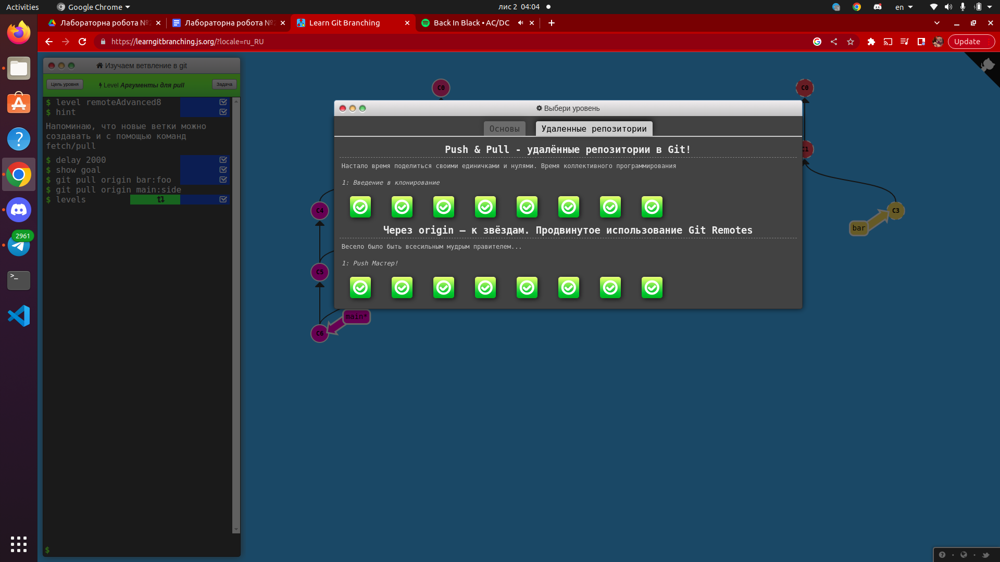

# ЛАБОРАТОРНА РОБОТА № 2
## Тема: Основні команди системи контролю версій Git.

### Виконав студент ІІІ курсу
### Напрям: «Інженерія програмного забезпечення» 
#### Група 2.2
### Стахов Артем Віталійович

###### **Ужгород-2022**

**План:**  
Пройти гру Git Learn та зробити скріншоти пройдених рівнів.  
Зробити git init папки із файлом  hello.txt та bash скриптом.  
Зробити git commit.  
Зробити git push у віддалений репозиторій у вітку lab_works_one_two.  
Додати в файл Readme звіт до лабораторної, щоб його можна було передивлятись на репозиторію коли переходиш у вітку.  
**Хід роботи**   
1.  
    
2.  
     
3.  
     
4.  
       
5.  
  
**Висновок: на цій лабораторній роботі я навчився користуватися git, а також використовувати  markdown**  
